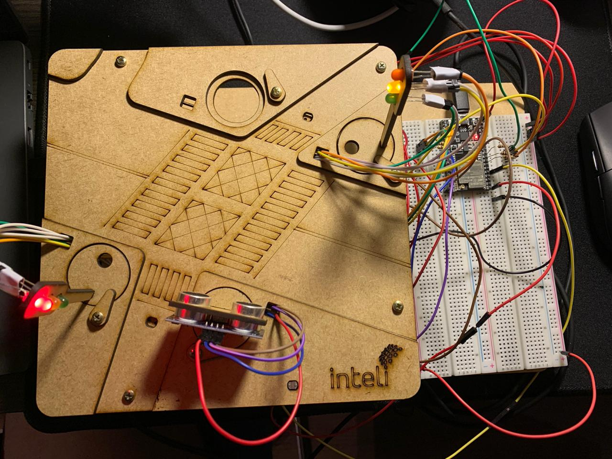
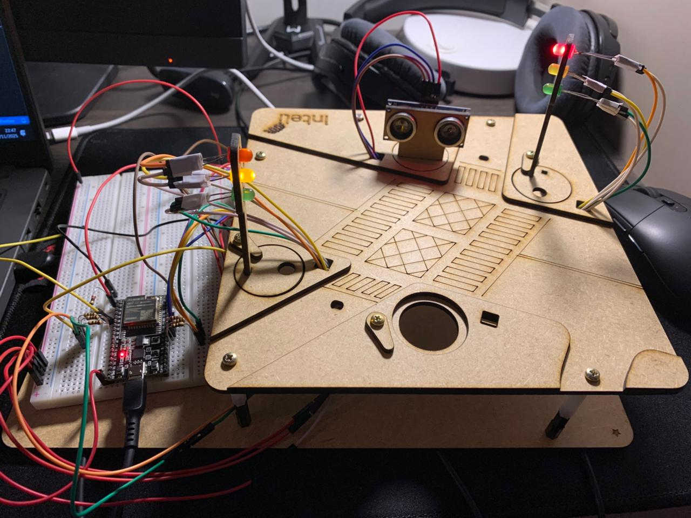
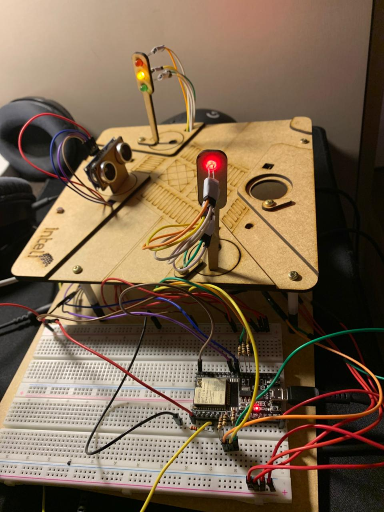

  

# 🚦 Semáforo Inteligente com LDR e Modo Noturno | Smart City

 G2: Átila Neto, Anny Cerazi, Eduardo Casarini, Giorgia Scherer, Leonardo Ramos, Lucas Cofcewicz, Rafael Josué

---

Este repositório apresenta um projeto de "Semáforo Inteligente" capaz de:

- Detectar a presença de veículos usando um **sensor LDR**  
- Adaptar o funcionamento para **modo noturno** automaticamente  
- Permitir controle remoto e visualização via **interface online**  
- Sincronizar dois semáforos simulando um cruzamento real  

---

## 🔧 Parte 1 — Montagem Física 

### ✔ Componentes utilizados
- 2x Semáforos montados com LEDs (Vermelho, Amarelo, Verde)
- 1x ESP32
- 1x LDR (Sensor de luminosidade)
- 1x Sensor Ultrassônico
- 1x Resistor de 10kΩ
- 6x Resistor de 100Ω
- Jumpers e protoboard
- Fonte USB

### ✔ Objetivo
O LDR detecta variação de luz, simulando:
- **Modo noturno** (ambiente escuro por longo período), o que leva ao modo onde as luzes amarelas se mantém piscando, significando atenção.

O Sensor Ultrassônico detecta proximidade, simulando:
- A **aproximação de veículos**, o que faz com que os semáforos sejam forçados a intercalar o seu funcionamento.

### Montagem Física:

</a>

</a>

</a>

### <b>Link para vídeo demonstrativo da montagem:</b> <a href="https://drive.google.com/file/d/1ph_QVCsRp-EOoWXgtPg4NzsNVKU6HYV1/view?usp=sharing">Acesse o vídeo demonstrativo</a>